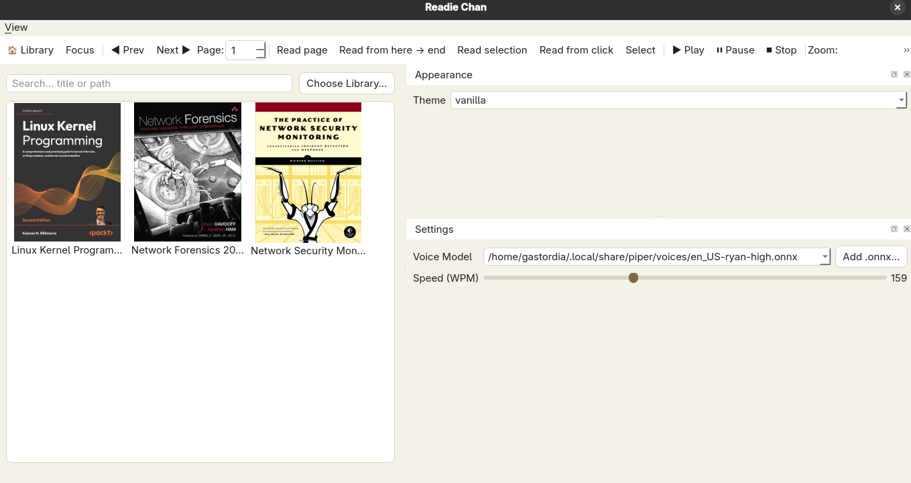
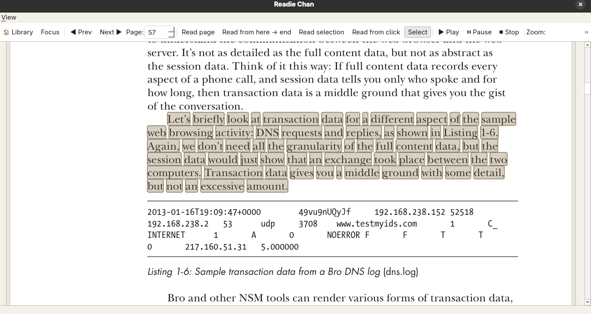

#  Readie Chan

A modern, lightweight PDF-to-speech application built with **PyQt5** and **Piper TTS**.  
It allows you to open PDF files, select text, and have it read aloud using high-quality offline voices.


## Screenshots

### Main Interface


### Text Selection for TTS


---

##  Features
- **Open & Read PDF Files** — Browse and load any PDF document.
- **Text-to-Speech (TTS)** — Uses [Piper](https://github.com/rhasspy/piper) for natural-sounding offline speech.
- **Voice Selection** — Easily choose from available Piper voice models.
- **Modern UI** — Clean, minimal, and responsive interface.
- **Focus Mode** — Highlight and read only selected text.
- **Customizable Toolbar** — Quick access to reading controls.

---


## Installation

1. **Clone the repository**
   ```bash
   git clone https://github.com/yourusername/pdf-voice-reader.git
   cd pdf-voice-reader ```


 Create and activate a virtual environment
```bash      
python3 -m venv venv
source venv/bin/activate       # Linux/macOS
venv\Scripts\activate          # Windows  
```

Install dependencies
```bash
pip install -r requirements.txt
```

Download Piper voice models

    Place your .onnx and .onnx.json files inside one of these directories:
```bash
        ~/.local/share/piper/voices # For Linux
```

▶ Usage

Run the app from the project root:
```python3
python gui.py
```
Keyboard Shortcuts

    Ctrl+O — Open PDF

    Space — Start/Pause reading

    Esc — Exit focus mode

 Voice Models

Piper voices come in .onnx and .onnx.json pairs. Example:
```bash
en_US-ryan-high.onnx
en_US-ryan-high.onnx.json
```
To install a new voice:
```bash
curl -L -o ~/.local/share/piper/voices/en_US-ryan-high.onnx \
     "https://example.com/en_US-ryan-high.onnx?download=true"
curl -L -o ~/.local/share/piper/voices/en_US-ryan-high.onnx.json \
     "https://example.com/en_US-ryan-high.onnx.json?download=true"
```
 Troubleshooting

    Invalid Piper JSON: Ensure the .onnx.json file is valid JSON. Re-download if needed.

    No voices found: Check the VOICE_DIRS list in util.py and place your voices accordingly.

    Focus mode stuck: Press Esc to exit or disable it from the toolbar.

  Making a Shell Alias (Optional)

  ```bash
 echo 'alias readie="python3 /Path/To/gui.py"' >> ~/.bashrc
 source ~/.bashrc
   
  ```

now you can run Readie Chan just by typing readie on the terminal :3
